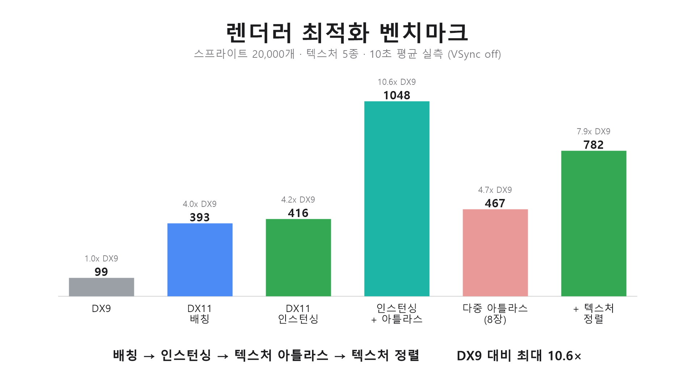
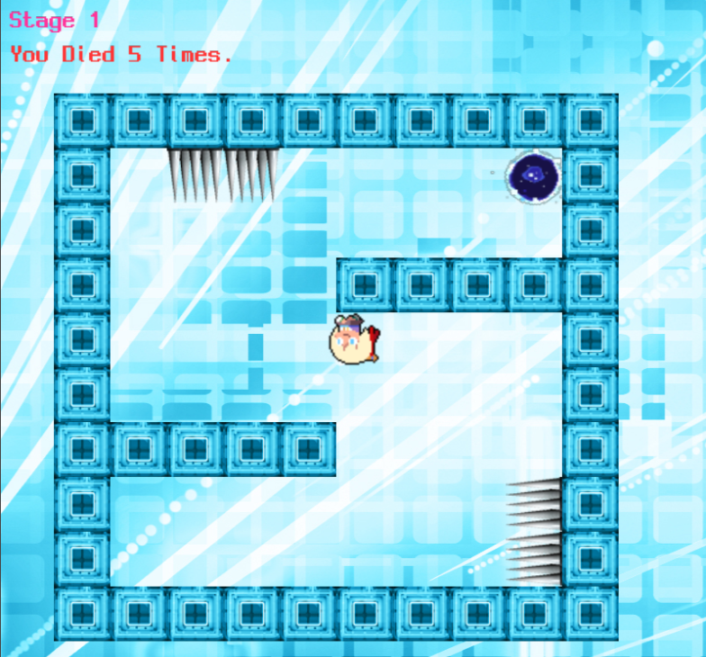

# DirectX 기반 2D 게임 엔진 포트폴리오

ECS 아키텍처를 직접 설계하고, 그 위에 DirectX 9/11 렌더러를 구현해 C++ 2D 게임 엔진을 제작했습니다.

상용 프레임워크 없이 렌더러 추상화 · 컴포넌트/시스템/이벤트 모델 · 씬·스테이지 관리 · 오디오까지 밑바닥부터 구현했으며, 엔진 검증용 데모로 중력 반전 액션 게임을 함께 만들었습니다.

DX11 렌더러는 외부 헬퍼 라이브러리 없이 직접 작성하고, 배칭 · 인스턴싱 · 텍스처 아틀라스 · 텍스처 정렬로 단계적으로 최적화하며 성능을 실측했습니다.

> **게임 클라이언트/엔진 직무 관점의 강점**
> - 자체 엔진 유지보수·고도화 — 상용 프레임워크 없이 ECS 코어·렌더 추상화·씬/스테이지 관리를 밑바닥부터 설계·구현.
> - DX9 / DX11 백엔드 + 렌더 최적화 — 게임 코드가 그래픽 API에 직접 의존하지 않도록 `IRenderer`로 추상화해, 설정값 하나로 DX9 · DX11 · 인스턴싱 백엔드를 런타임 교체.
> - 메모리/구조 최적화 — 64bit 비트마스크 컴포넌트 쿼리, `ObjectPool` 재사용, 데이터 지연 삭제.
> - C++17/STL·템플릿 메타프로그래밍 — zero-cost 타입 ID, fold-expression, `static_assert` 컴파일타임 검증.

---

## 목차

1. 한눈에 보는 구조
2. ECS 코어 (`MyECS.h`)
3. 컴포넌트
4. 시스템
5. 렌더러 추상화
6. 게임 소개 — Bit Bit 8-Bit Jump!
7. 주요 소스 코드
8. 빌드 / 실행 · config
9. 개발 범위 (본인 기여)

---

## 1. 한눈에 보는 구조

```
┌─ 플랫폼 / 렌더 레이어
│    Window(Win32) · GraphicManager
│    IRenderer ─ DX9 / DX11 / DX11Instanced
│    TextureManager · SoundManager(FMOD) · Input
└──────────────┐
               │  (IRenderer 인터페이스 한 겹)
┌─ ECS 코어 (MyECS.h)
│    Manager · Entity · System · Event
│    템플릿 ComponentID · 64bit 비트마스크 쿼리
│    ObjectPool · Logic/Render 시스템 분리
└──────────────┐
               │
┌─ 게임 콘텐츠
│    Components · Systems · Scene/Stage · JSON 맵
└──────────────
```

핵심 설계 의도는 게임 로직(ECS·시스템)을 그래픽 API에서 떼어내는 것입니다.
렌더러는 `IRenderer` 인터페이스 뒤에 숨고, `config.ini` 설정값 하나로 실행 시점에 백엔드를 교체합니다.

---

## 2. ECS 코어 (`MyECS.h`)

외부 ECS 라이브러리(EnTT 등) 없이 단일 헤더로 직접 구현한 데이터 지향 코어입니다. **Entity**(식별자+컴포넌트 보관소) · **Component**(순수 데이터) · **System**(컴포넌트 조합 처리 로직) 세 축으로 나뉘고, `Manager`(싱글톤)가 총괄합니다.

### 2-1. 타입 ID — 컴파일 없이 zero-cost 부여
```cpp
template <class T>
ComponentID GetComponentID() { static ComponentID id = GetNextComponentID(); return id; }
```
함수 지역 `static`은 그 타입으로 처음 호출될 때 한 번만 초기화되며 전역 카운터를 증가 → 타입 → 안정적 정수 ID 매핑. 이 정수를 배열/비트 인덱스로 그대로 사용하므로 `typeid`/RTTI·해시 조회 없이 O(1) 타입 식별. `SystemID`/`EventID`도 동일.

### 2-2. 컴포넌트 저장 & 64bit 비트마스크 쿼리
엔티티는 컴포넌트를 타입 ID를 인덱스로 하는 희소 슬롯에 담고, 보유 집합을 비트마스크로도 유지합니다.
```cpp
template <class T, class... Args>
void Entity::AddComponent(Args&&... args) {
    ComponentID id = GetComponentID<T>();
    if (id >= mComponents.size()) mComponents.resize(id + 1);
    mComponents[id] = std::make_unique<T>(std::forward<Args>(args)...);
    mComponentBitmask.Add(id);
}
```
`ComponentBitmask`는 `vector<uint64_t>` 블록으로 표현 — 비트 하나가 컴포넌트 하나:
```cpp
void Add(ComponentID id) { blocks[id/64] |= (1ull << (id % 64)); }
bool HasComponent(const ComponentBitmask& req) const {
    if (blocks.size() < req.blocks.size()) return false;               // 조기 종료
    for (size_t i = 0; i < req.blocks.size(); ++i)
        if ((blocks[i] & req.blocks[i]) != req.blocks[i]) return false; // 블록별 AND
    return true;
}
```
질의 마스크는 fold-expression으로 합성하고 타입 조합별로 `static` 캐싱합니다. 그래서 다중 컴포넌트 순회가 블록별 64bit AND 몇 번으로 끝납니다:
```cpp
template <class... Types, class Func>
void Manager::Each(Func&& fn) {
    const ComponentBitmask& req = GetComponentBitmask<Types...>();       // static 캐싱
    for (auto& ent : mEntities)
        if (ent->mComponentBitmask.HasComponent(req))
            fn(ent.get(), ent->GetComponent<Types>()...);              // 컴포넌트 포인터 전달
}
```

### 2-3. 시스템 — 등록 · Logic/Render 분리 · 런타임 토글
- **Logic / Render 분리** — `Manager::Tick`은 Logic만, `Manager::Render`는 Render만 실행 → 갱신/그리기 루프 분리.
- **가변 템플릿 등록** — `RegisterSystem<A,B,C>()`로 여러 시스템을 한 번에, `SystemID` 인덱스로 배치.
- **런타임 토글** — `Activate/InactivateSystem<T>`가 `mSystems` ↔ `mInactivatedSystems` 이동으로 시스템을 켜고 끔(예: 타이틀에서 Collision/PlayerUpdate 비활성화).

### 2-4. 이벤트 — 함수 포인터 디스패치 + 컴파일타임 검증 + 즉시/지연
구독 테이블은 `mSubscribers[EventID][SystemID] = { SystemID, void(*)(Manager&, System*, void*) }` — 이벤트별·시스템별 함수 포인터를 보관. 디스패처는 템플릿 static 함수 하나:
```cpp
template <class TypeSystem, class TypeEvent>
static void InvokeEvent(Manager& m, System* sys, void* ev) {
    static_assert(std::is_base_of_v<System, TypeSystem>, "Invalid System");
    static_assert(std::is_base_of_v<EventSubscriber<TypeEvent>, TypeSystem>,
                  "Invalid Subscriber");
    static_cast<EventSubscriber<TypeEvent>*>(static_cast<TypeSystem*>(sys))
        ->Received(m, static_cast<TypeEvent*>(ev));
}
```
- `static_assert`로 "이 시스템이 실제로 그 이벤트 구독자인가"를 컴파일 타임에 강제 — 잘못된 구독은 빌드가 막힘.
- 이벤트 타입마다 `virtual`을 늘리지 않고 등록 시 함수 포인터를 박아 디스패치 비용 최소화.
- `ExecuteEvent` 즉시 전파 / `AddEvent` 지연 큐잉 후 `EmitDeferredEvents`에서 일괄 처리 — 큐를 로컬 swap 하는 루프라 디스패치 중 재발행(재진입)에도 안전.

### 2-5. 엔티티 생명주기 & 메모리 — ObjectPool + 지연 삭제
- **ObjectPool** — 리스트 기반 프리얼록, 소진 시 청크 확장. 매 프레임 생성/소멸하는 발사체·이펙트의 힙 할당 억제.
- **`CreateEntity(functor)`** — 풀에서 꺼내 → functor가 컴포넌트 구성 → `OnEntityCreated` 발행 → 등록.
- **데이터 지연 삭제** — `DestroyEntity`는 `PendingDestroy` 플래그만, 프레임 말미 `CleanEntity`가 `OnEntityDestroyed` 발행 후 풀 반환 → 순회 중 삭제해도 반복자 무효화 없음.

```
Manager::Tick:  Logic 시스템 Tick → EmitDeferredEvents → CleanEntity(회수) → ClearDeferredEvents
```

### 2-6. 추후 개선 사항
- **`Each`의 선형 스캔** — 현재 `Each`는 전체 엔티티를 훑어 비트마스크로 거르는 O(N) 방식. 엔티티가 많아지면 매칭되지 않는 엔티티까지 매 프레임 검사하는 비용이 커짐.
- **컴포넌트 데이터의 불연속성** — 컴포넌트를 엔티티별 `unique_ptr`로 힙에 두어, 같은 컴포넌트라도 메모리에 흩어져 순회 시 캐시 미스가 잦음.
- **아키타입(archetype) 도입** — 같은 컴포넌트 조합을 packed array로 연속 배치하면, 매칭 스캔을 없애고 데이터 지역성을 높여 대규모 엔티티에서 순회 성능을 개선할 수 있음.

---

## 3. 컴포넌트 (`Components.h`)

순수 데이터(POD) 컴포넌트. 시스템이 생성 시 포인터를 캐싱해 매 틱 직접 변형합니다.

| 컴포넌트 | 데이터 | 비고 |
|---|---|---|
| `Position` | x, y | 픽셀 좌표(Y-down) |
| `Velocity` | vx, vy, RunSpeed, JumpSpeed, GravityScale | 이동 파라미터 |
| `Rotation` | RotZ | 도(degree) |
| `Sprite` | FileName, Scale, Flip, Width/Height, IsActive | 생성 시 `TextureManager`로 크기 조회 |
| `Animation` | SpriteState, CurIndex, EndIndex, AnimSpeed, Loop | 상태명 = 스프라이트 시트 키 |
| `Collider` | BoxSize[4], Collided[4], CanCollision[4] | 4방향(상/하/좌/우) AABB |
| `Player` | PlayerState, GravityDirection, InitPos, InAir | 상태 기계 본체 |
| `Obstacle` | Kind(벽/가시/포탈), gridX, gridY | 타일 브로드페이즈 키 |

`Collider`는 상하좌우 4면을 개별 박스/플래그로 두어, 중력 반전 게임 특유의 "어느 면이 바닥인가"를 방향별로 다룹니다.

---

## 4. 시스템 (`Systems.h`)

단일 책임 시스템의 조합. `Stage1::Init`에서 Logic→Render 순으로 등록됩니다.

| 시스템 | 종류 | 책임 |
|---|---|---|
| `InputSystem` | Logic | 키 입력을 `InputEvent`/`ChangeStage` 이벤트로 변환 |
| `StageSystem` | Logic | `StageN.json` 로드 → 타일 코드별 엔티티 전개 |
| `PlayerUpdateSystem` | Logic | 게임의 두뇌 — 오토런/점프/구르기(중력 90° 전환)/충돌 반응/사망·리스폰 상태 기계 |
| `AnimationSystem` | Logic | `Each<Sprite,Animation>` 프레임 진행, 루프/원샷 |
| `CollisionSystem` | Logic | 5×5 타일 브로드페이즈 + 4면 AABB + 침투 보정, 충돌/피격/포탈 이벤트 발행 |
| `SpriteDrawSystem` | Render | 플레이어 추종 카메라 + 화면 밖 컬링 + `DrawSprite` |
| `FontDrawSystem` | Render | UI/텍스트 렌더 |
| `SoundSystem` | Logic | `PlayBGM`/`PlaySFX`/`PlayerDamaged` 등 수신 → FMOD 재생 |

**시스템 간 통신은 이벤트로만** — 서로 직접 호출하지 않아 느슨하게 결합되고, 시스템을 단위로 켜고 끌 수 있습니다. 한 번의 점프 흐름:
```
InputSystem ──InputEvent("X")──▶ PlayerUpdateSystem   (점프 상태 진입 + 속도 부여)
PlayerUpdateSystem ──위치 이동──▶ CollisionSystem
CollisionSystem ──PlayerCollided / PlayerDamaged / PortalCollided──▶ PlayerUpdateSystem / SoundSystem
```

---

## 5. 렌더러 추상화 — `IRenderer` (DX9 / DX11 / 인스턴싱)

게임 코드는 DirectX를 직접 부르지 않고 `IRenderer` 인터페이스에만 의존합니다.
```cpp
class IRenderer {
    virtual TextureHandle CreateTexture(const std::wstring& path) = 0;
    virtual void DrawSprite(TextureHandle*, float x, float y,
                            float sx, float sy, float rot, bool flip) = 0;
    virtual void DrawText(FontHandle*, const std::wstring&, int x, int y, const Color&) = 0;
    // RenderStart/End, SpriteRenderStart/End, FontRenderStart/End ...
};
```
- `TextureHandle` / `FontHandle`은 `void*`로 백엔드 리소스를 감싸(`LPDIRECT3DTEXTURE9` ↔ `ID3D11ShaderResourceView*`) 게임 측엔 동일 타입으로 노출.
- `GraphicManager`가 `std::unique_ptr<IRenderer>`를 소유하고, `config.ini`의 `[Graphics] Renderer = 9 | 11 | 12`로 실행 시 백엔드 선택.
- 세 백엔드: **DX9Renderer**(`D3DXSprite`/`D3DXFont`) · **DX11Renderer**(직접 파이프라인 + 배칭) · **DX11InstancedRenderer**(인스턴싱 + 텍스처 정렬).
- 동일 게임 로직이 세 백엔드에서 그대로 동작 → "렌더 백엔드 교체"를 축소판으로 구현.

### 5-1. DX11 백엔드 — 자체 스프라이트 파이프라인

DX11 렌더러는 외부 헬퍼 라이브러리 없이 순수 D3D11 + Win32/DX 스택으로 직접 구현했습니다.

- **셰이더 파이프라인 직접 구성** — HLSL VS/PS를 `D3DCompile`로 런타임 컴파일, 인풋 레이아웃, 직교투영 상수버퍼(좌상단 원점·Y-down), 알파 블렌드/선형 샘플러/컬링 오프 래스터 스테이트를 모두 직접 생성.
- **동적 정점 버퍼 + 배칭** — 쿼드를 CPU 버퍼에 모아 같은 텍스처끼리 묶어 드로우콜 최소화. `MAP_WRITE_DISCARD`/`MAP_WRITE_NO_OVERWRITE` 링 버퍼로 GPU 스톨 없이 스트리밍.
- **WIC 직접 텍스처 로드** — `IWICImagingFactory`로 디코드 → `GUID_WICPixelFormat32bppRGBA` 변환 → `CreateTexture2D`(IMMUTABLE)+SRV. `ComPtr` 기반 리소스 수명 관리.
- **DirectWrite 런타임 글리프 아틀라스 폰트** — `.ttf`를 DirectWrite 폰트페이스로 로드하고, 필요한 글리프를 그 순간 래스터라이즈(`IDWriteGlyphRunAnalysis`)해 아틀라스 텍스처에 캐싱(셸프 패킹). 글자 수가 수천에 달해 사전 베이크가 불가능한 CJK(한/중/일) 라이브 서비스 로컬라이징의 온디맨드 방식.
- **플립 모델 스왑체인** — `DXGI_SWAP_EFFECT_FLIP_DISCARD` 더블 버퍼 + VSync/`ALLOW_TEARING`.

> Windows SDK 표준 라이브러리(`d3d11`·`dxgi`·`dwrite`·`windowscodecs`·`d3dcompiler`)만으로 셰이더·정점버퍼·상수버퍼·스테이트·배칭·텍스처/폰트 로딩을 직접 구현했습니다.

### 5-2. 렌더러 성능 벤치마크 (실측)

동일 인터페이스 아래 백엔드/기법만 바꿔가며 최적화 단계별 이득을 측정했습니다. 전용 스트레스 씬(스프라이트 20,000개 · 텍스처 5종 · 컬링 없이 전량 렌더)에서 각 설정을 11초 평균(워밍업 1초 + 측정 10초)으로 기록했습니다. (x64 Release · VSync off · 동일 씬 고정 시드)



| 기법 | 평균 FPS | DX9 대비 |
|---|---:|---:|
| DX9 (개별 드로우콜) | 99 | 1.0× |
| DX11 배칭 | 393 | 4.0× |
| DX11 인스턴싱 | 416 | 4.2× |
| 인스턴싱 + 단일 아틀라스 | 1,048 | 10.6× |
| 인스턴싱 + 다중 아틀라스(8장) | 467 | 4.7× |
| + 텍스처 정렬 | 782 | 7.9× |

**각 기법 설명**

- **DX9** — 고정 기능 파이프라인. 구현은 단순하지만 스프라이트마다 개별 드로우콜이 나가 대량 렌더에서 CPU 병목이 큼.
- **DX11 배칭** — 같은 텍스처의 스프라이트를 모아 드로우콜을 병합. 드로우콜 수를 크게 줄여 대량 렌더에 강함.
- **DX11 인스턴싱** — 쿼드 하나를 공유하고 스프라이트별 데이터만 전송(정점 조립·대역폭↓). 다만 텍스처가 매 스프라이트 바뀌면 한 번에 묶을 인스턴스가 없어 배칭과 큰 차이가 없음.
- **인스턴싱 + 단일 아틀라스** — 여러 텍스처를 아틀라스 한 장으로 합쳐 하나의 긴 배치로 병합 → 인스턴싱이 최대 효과. 단, 실제 게임은 텍스처를 한 장에 다 담을 수 없어 **이론적 상한**.
- **인스턴싱 + 다중 아틀라스(8장)** — 현실적으로 텍스처는 여러 아틀라스 페이지로 나뉨. 같은 텍스처가 흩어져 배치가 잘게 쪼개지고 인스턴싱 이점이 줄어 성능이 하락.
- **텍스처 정렬** — 프레임의 모든 인스턴스를 텍스처(SRV)별로 모아 SRV당 한 번에 그려 드로우콜을 다시 병합 → 성능 회복. 그리기 순서를 재정렬하므로 불투명/동일 z-레이어 스프라이트에 적합.

> 경량 씬(스프라이트 수십 개)에선 DX9 고정 기능이 프레임당 오버헤드가 낮아 오히려 빠릅니다(약 1,000개부터 DX11 역전). 위 결과는 대량 부하로 DX9 드로우콜 비용이 병목이 되는 구간입니다.

---

## 6. 게임 소개 — Bit Bit 8-Bit Jump!



엔진 위에서 동작하는 **중력 반전 2D 액션 플랫포머**입니다. 플레이어는 자동으로 달리고, 플레이어가 직접 중력 방향을 바꿔 벽·천장·바닥을 타고 목표 지점까지 나아갑니다.

- **조작** — `X` 점프, `Z` 구르기(중력을 시계방향 90° 회전: DOWN→RIGHT→UP→LEFT), `R` 스테이지 재시작
- **규칙** — 가시 등 장애물에 닿으면 시작 위치로 리스폰, 포탈에 닿으면 다음 스테이지로 진행. 총 3개 스테이지.
- **중력 반전** — 중력 방향에 맞춰 `Collider` 박스와 스프라이트 회전을 함께 재설정해, 어느 벽이든 "바닥"이 됩니다.
- **데이터 주도 스테이지** — 맵은 코드가 아니라 `Data/Stage/StageN.json`의 정수 타일 그리드로 정의(0 빈칸 / 1 벽 / 2~5 가시 / 6 플레이어 / 7 포탈). 벽 타일은 이웃이 벽이면 그 면 충돌을 꺼 브로드페이즈 비용을 줄입니다.

---

## 7. 주요 소스 코드

| 파일 | 역할 |
|---|---|
| `MyECS.h` | ECS 코어 — Manager/Entity/System/Event, 템플릿 타입 ID, 비트마스크, 이벤트 |
| `Components.h` · `Enumerates.h` · `Events.h` | 데이터 컴포넌트 · 상태 enum · 이벤트 정의 |
| `Systems.h` | 시스템 일괄 include |
| `InputSystem.h` · `StageSystem.h` · `PlayerUpdateSystem.h` · `AnimationSystem.h` · `CollisionSystem.h` · `SpriteDrawSystem.h` · `FontDrawSystem.h` · `SoundSystem.h` | 개별 게임 시스템 |
| `IRenderer.h` | 렌더 백엔드 인터페이스 (`TextureHandle`/`FontHandle`/`Color`) |
| `DX9Renderer.h` · `DX9Renderer.cpp` | DX9 백엔드 (`D3DXSprite`/`D3DXFont`) |
| `DX11Renderer.h` · `DX11Renderer.cpp` | DX11 배칭 백엔드 (자체 파이프라인) |
| `DX11InstancedRenderer.h` · `DX11InstancedRenderer.cpp` | DX11 인스턴싱 + 텍스처 정렬 백엔드 |
| `GraphicManager.h` · `GraphicManager.cpp` | 렌더러 소유·생성, config 기반 백엔드 선택 |
| `TextureManager.h` · `TextureManager.cpp` | 텍스처/폰트 캐시, 아틀라스 서브렉트 등록 |
| `SoundManager.h` · `SoundManager.cpp` | FMOD BGM/SFX |
| `SceneManager.h/.cpp` · `Scene.h/.cpp` · `Stage1.h/.cpp` | 씬 전환 및 스테이지 진입점 |
| `StressStage.h` | 벤치마크용 스트레스 씬 |
| `StageSystem.h` · `JsonReader.h` | JSON 맵 파싱 → 엔티티 전개 |
| `Window.h/.cpp` · `Timer.h` · `InputManager.h/.cpp` | Win32 창 · dt 타이머 · 입력 |
| `ObjectPool.h` · `Singleton.h` | 공통 유틸(오브젝트 풀 · 싱글톤) |
| `GameSystem.cpp` · `MyGame.cpp` | 부트스트랩 + 메인 루프 |

---

## 8. 빌드 / 실행 · config

- 플랫폼: Windows, Visual Studio (`MyGame.sln`), x64 · 오디오: FMOD · 해상도: 800 × 800
- 조작: `X` 점프 / `Z` 구르기 / `R` 재시작 / 숫자 `1`~`4` 스테이지 직접 이동
- DX11 백엔드는 외부 라이브러리 없이 Windows SDK 표준(`d3d11`/`dxgi`/`dwrite`/`windowscodecs`/`d3dcompiler`)만 사용

### `config.ini` (`Data/Config/config.ini`)

| 섹션 | 키 | 값 | 설명 |
|---|---|---|---|
| `[Graphics]` | `Renderer` | 9 / 11 / 12 | DX9 / DX11 배칭 / DX11 인스턴싱 |
| `[Graphics]` | `VSync` | 0 / 1 | 수직동기(0이면 제한 해제, `ALLOW_TEARING`) |
| `[Graphics]` | `ShowFPS` | 0 / 1 | 화면 HUD로 FPS 표시 |
| `[Stress]` | `Count` | N | >0 이면 스프라이트 N개 스트레스 씬(벤치마크) |
| `[Stress]` | `Textures` | 1~5 | 사용할 텍스처 종류 수(드로우콜 부하) |
| `[Stress]` | `Atlas` | 0 / 1 | 텍스처들을 아틀라스 서브렉트로 렌더 |
| `[Stress]` | `AtlasPages` | K | 아틀라스 페이지(별도 SRV) 수 — K장에 랜덤 분산 |
| `[Stress]` | `Sort` | 0 / 1 | SRV별 텍스처 정렬로 SRV당 draw 1회 병합 |

---

## 9. 개발 범위 (본인 기여)

개인 프로젝트입니다. 엔진 코어와 게임을 단독으로 설계·구현했고, 이후 렌더러 고도화·최적화 작업을 추가로 진행했습니다.

**원엔진 (단독 설계·구현)**

- ECS 코어(`MyECS.h`) — Manager/Entity/System/Event, 템플릿 타입 ID, 64bit 비트마스크, ObjectPool, 지연 삭제, 하이브리드 이벤트 시스템
- 렌더 추상화(`IRenderer`)와 DX9 / DX11 백엔드, `config.ini` 기반 런타임 백엔드 선택
- 전 게임 시스템(Input/Stage/PlayerUpdate/Animation/Collision/Sprite·Font Draw/Sound)
- 데이터 주도 스테이지 파이프라인(JSON 맵 → 엔티티 전개), 중력 반전 게임플레이
- Win32 창·타이머·입력·씬 관리 등 플랫폼 레이어, FMOD 오디오 연동

**렌더러 고도화·최적화 (추가 작업)**

- DX11 백엔드 자체 파이프라인 구현(셰이더·정점버퍼·상수버퍼·스테이트·배칭·WIC 텍스처·DirectWrite 글리프 아틀라스 폰트)
- 인스턴싱 렌더러(`DrawIndexedInstanced`) + 텍스처 아틀라스(서브렉트 UV) + SRV 텍스처 정렬 구현
- DX9 / DX11 배칭 / DX11 인스턴싱을 다중 아틀라스 페이지 기준으로 성능 벤치마크·분석(§5-2)

> 외부 의존: FMOD(오디오), D3DX(DX9 백엔드 전용 스프라이트/폰트). DX11 계열은 외부 헬퍼 라이브러리 없이 순수 D3D11 + DirectWrite/WIC(Windows SDK 표준)로 구현. 그 외 ECS·게임 로직·렌더 추상화·DX11 파이프라인은 외부 라이브러리 없이 직접 구현.
